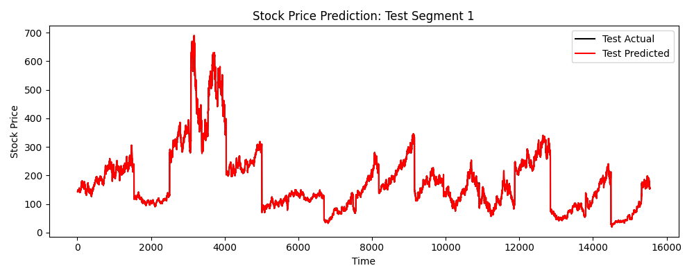
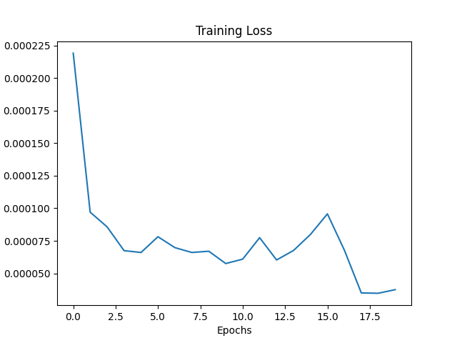

# Multi-Asset Daily Stock Price Forecasting with LSTM Networks

A deep learning framework built in **PyTorch** to forecast multi-asset daily stock mid-prices. Developed as a Bachelor's Thesis in Physics (NKUA), this project addresses key financial time-series modeling challenges, including multi-asset batching, temporal continuity, non-linear feature extraction, and outlier-resistant loss optimization.

---

## 🔬 Key Architectural & Technical Highlights

- **Multi-Stock Sequential Batching (`SingleStockBatchSampler`):** Custom PyTorch Sampler that batches sequences strictly by ticker symbol, preventing data leakage across independent price streams.
- **Stateful Recurrent Tracking:** Explicit management of hidden and cell states (`h_t, c_t`) across batches with dynamic batch trimming and state resetting between distinct stock transitions.
- **Enhanced Recurrent Block:**
  - 2-layer LSTM backbone.
  - Residual / Skip connection directly linking input features to the pre-readout representations.
  - `LayerNorm` and `LeakyReLU` activations for smooth gradient flow and vanishing gradient mitigation.
- **Robust Loss Formulations:** Implementation of `LogCoshLoss` and `HuberLoss` as smooth, outlier-tolerant alternatives to standard Mean Squared Error (MSE).
- **Data Pipeline & Preprocessing:**
  - Mid-Price formulation: $\text{Mid} = \frac{\text{High} + \text{Low}}{2}$.
  - Exponential Moving Average (EMA) filtering during training.
  - Strict chronological train/validation/test chronological splitting (80% / 10% / 10%).

---

## 📊 Results & Visualizations

### Predicted vs. Actual Mid-Prices
The model accurately captures non-linear price trajectories and local trend shifts across test segments:

| Test Segment Prediction | Training Loss Convergence |
| :---: | :---: |
|  |  |

### Error Metrics Evaluated
- **Mean Absolute Error (MAE)**
- **Median Absolute Error**
- **Bias Error (Directional Skewness)**
- **Maximum Over/Underestimation Limits**

---

## 🛠️ Tech Stack & Requirements

- **Language:** Python 3.9+
- **Deep Learning Framework:** PyTorch (`torch`, `torch.nn`)
- **Data Manipulation:** NumPy, Pandas, Scikit-Learn (`StandardScaler`)
- **Visualization:** Matplotlib

### Installation
Clone the repository and install dependencies:
```bash
git clone [https://github.com/marialenaef/stock-price-prediction-lstm.git](https://github.com/marialenaef/stock-price-prediction-lstm.git)
cd stock-price-prediction-lstm
pip install -r requirements.txt
